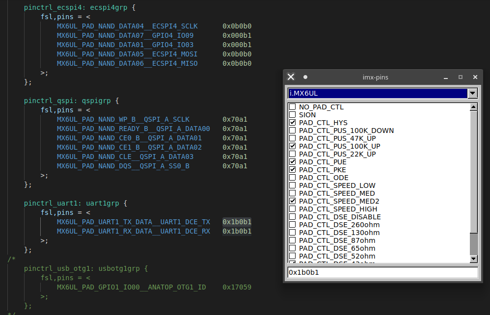

# imx-pins

## About

Generate and decode IOMUX pad settings for NXP's i.MX series processors.

Uses [FLTK 1.4](https://www.fltk.org/) and [nlohmann-json](https://json.nlohmann.me/)



## Compiling

```
mkdir build
cd build
cmake ..
cmake --build .
```

Run with `./bin/imx-pins`

## Installing

```
sudo cmake --install .
```

## Adding support for a new soc

Simply create a JSON file in pinsettings/ using values from the IOMUX section of the processors reference manual.

```
{
    "NAME": "SOMESOC",
    "PAD_CTL": {
        {"fields": "8", "name": "Pull Resistors Enable", "type": "bool"},

        {"fields": "2:0", "name": "Slew Rate", "type": "enum",
        "values": [
            {"name": "Slow Slew Rate", "value": "0b000"},
            {"name": "Fast Slew Rate", "value": "0b101"}
        ]}
}
```

Where "fields" represents the index(es) that all the bits that can be set by the group.

In the above example "8" would mean that only the eight bit can be set by this option group.

If "fields" is "2:0" then the bits 2, 1 and 0 can be set by this option group.
