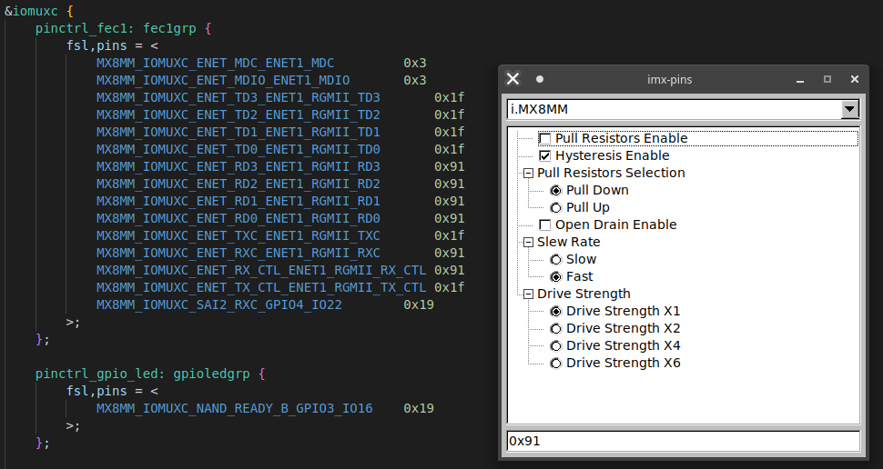

# imx-pins

## About

Generate and decode IOMUX pad settings



## Adding support for a new soc

Simply create a JSON file in pinsettings/ using values from the IOMUX section of the processors reference manual.

```
{
    "NAME": "SOMESOC",
    "PAD_CTL": {
        "PAD_CTL_THIS": {
            "value": 0,
            "fields": 4
        },
        "PAD_CTL_THAT": {
            "value": 1,
            "fields": 4
        }
}
```

Where "fields" is an integer representing all the bits that could be set by the group.

In the above example 4 (0b100) would mean that only the third bit is changed by this option

If "fields" is 6 (0b110) then the second and third bit can be set by this option group
